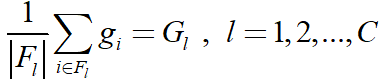
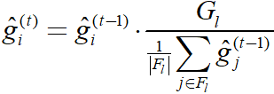
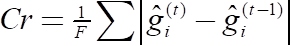
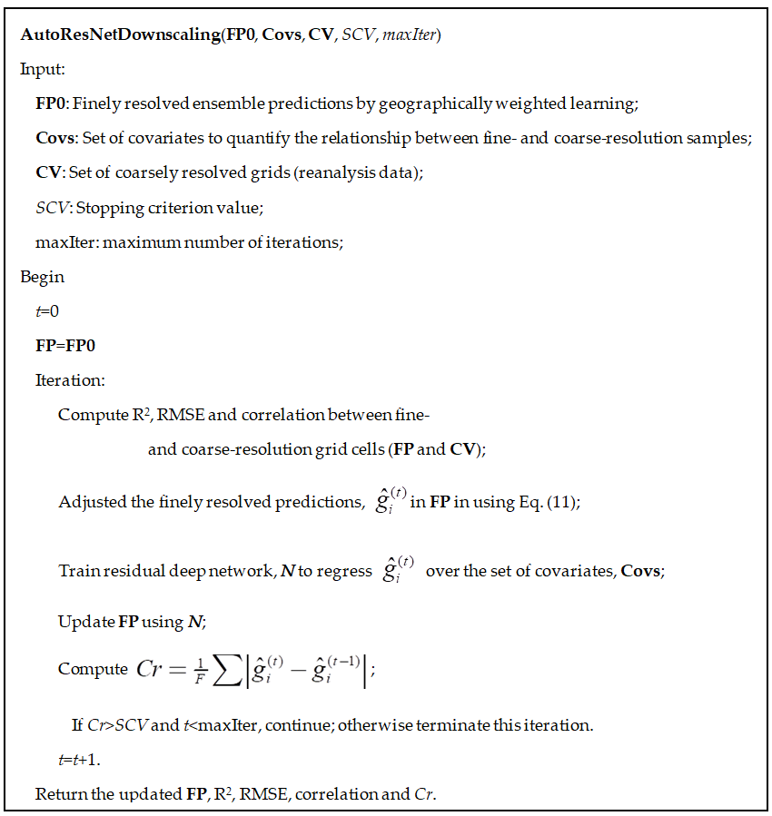
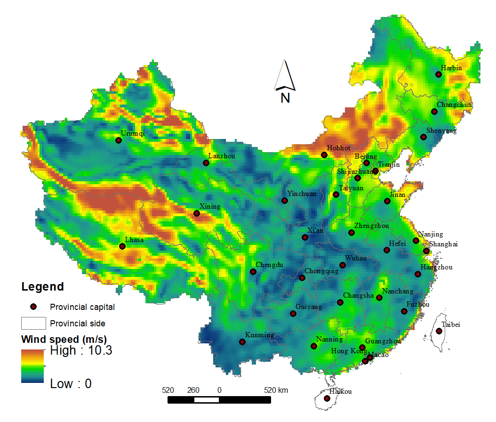
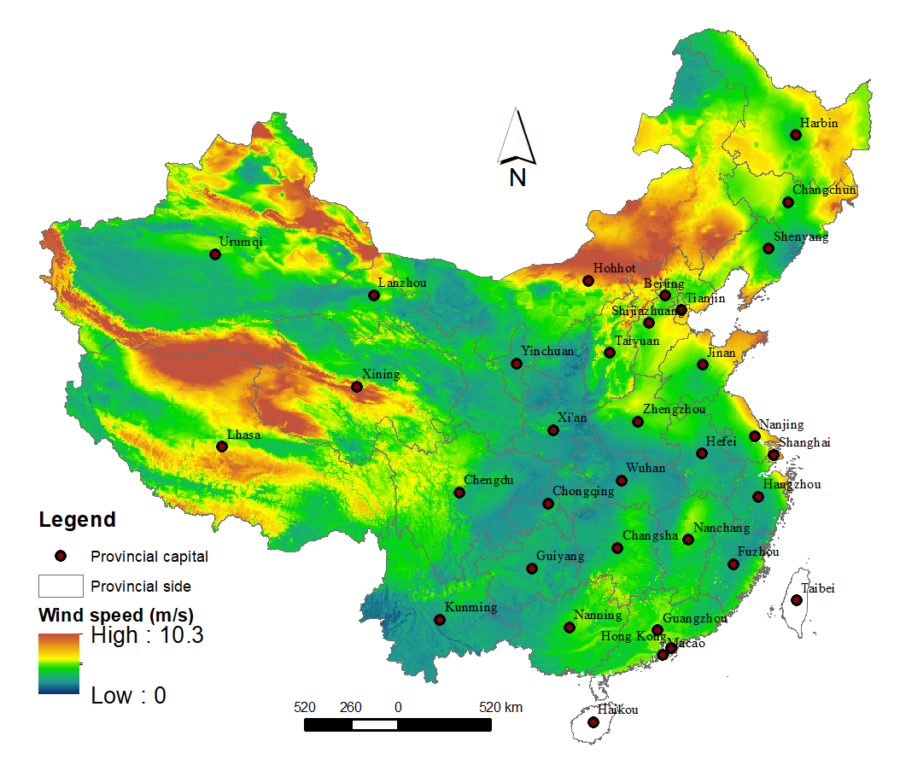

downscaledl: Library of Downsclaing RS Image using Deep Learning
================

Introduction
------------

This package provides the functions of downscaling RS images (downscaledl) using deep learning algorithms. Current version just support the KERAS package of deep learning. For downscaling of continuous variables, we use residual deep network as the base model.

Downscaling algorithm using residual deep autoencoder
-----------------------------------------------------

Assume the target variable value at a coarse-resolution grid cell, *G<sub>i</sub>*, *i*=1,…,*C* (*C* is the number of coarsely resolved grid cells), and at a fine-resolution grid cell, *g<sub>i</sub>*, *i*=1,…,*F* (*F* is the number of finely resolved grid cells).


where *F<sub>l</sub>* represents the set of finely resolved grid cells that overlay the *l<sup>th</sup>* coarsely resolved grid cell.

For implementation, we adjusted the predicted values for each finely resolved cell using the following formula to ensure equality in the above equation and used a deep residual network to update the regression in each iteration: 

where *G<sub>l</sub>* is assumed to be overlaid with *g<sub>i</sub>*, t represents the iteration time, and denotes the adjusted values for iteration t.

Iterations proceeded until the average over the absolute difference in the finely resolved grid cells between two continuous iterations, i.e.,  , was equal to or below a stopping criterion value or the maximum number of iterations was attained. The complete algorithm is given in the following.



Test samples
------------

The original coarse-level picture (wind speed of China's mainland) before downscaling: 

The fine-resolution picture (wind speed of China's mainland) after downscaling:


Install of the package
----------------------

-   Use the R's cran library Enter R and enter the following command to install the package and then load it:

``` r
  install.packages("downscaledl")
  library(downscaledl)
```

Use of the package
------------------

``` r
  tfile=paste("/data/test.csv",sep="") # CSV file for fine-resolution text data of predictors.  
  chinacovs=read.csv(tfile) 
  tcols=c("lat","lon","lat2","lon2","lonlat","elevation","julian_day",
        "image_value","pblh") # the features to be selected 
  chinacovsSP=SpatialPointsDataFrame(chinacovs[,c("lon","lat")],chinacovs,
         proj4string=CRS("+proj=longlat +datum=WGS84 +no_defs +ellps=WGS84 +towgs84=0,0,0"))
  chinacovsSP_p=spTransform(chinacovsSP,CRSobj=
         CRS("+proj=lcc +lat_1=30 +lat_2=62 +lat_0=0 +lon_0=105 +x_0=0 +y_0=0 +ellps=krass +units=m +no_defs"))
  gridded(chinacovsSP_p)=TRUE
  chinastk=stack(chinacovsSP_p)
  
  coarseImg_fld="/data/coarseGrd.tif" # Tiff file of coarse resolution 
  coarseImg=raster(coarseImg_fld)
  c.grid=gldas_re2_cn_p 
  r2=subset(chinastk,c("lon","lat","elevation","pblh","lat2","lon2","lonlat")) # Predictors tiff stack to be used in downscaling 
  tfl="/data/finedGrd.tif" # Tiff file of fined resolution to be downscaled (output)
  fpredict0=raster(tfl)
  ares=ResautoDownscale(r2,fpredict0,c.grid,ss= 0.2, cores= 5, thresh = 0.01,ntime=6) # Downscaling and return the results.  Downscaling and return the results. 
```

Contact
-------

Welcome to contact Dr. Lianfa Li at <lspatial@gmail.com>
